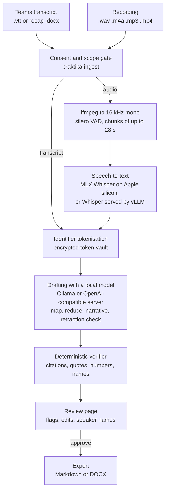

# Praktika

**On-premises meeting minutes with evidence citations and human approval.**

Praktika (Greek πρακτικά, "minutes") turns a meeting transcript or recording into draft minutes in
which every decision, action, open question and risk cites the transcript segment it came from. A
named person then reviews, corrects and approves the draft; nothing can be exported before that.
Speech-to-text and the drafting model run on your own hardware, identifiers such as account and
card numbers are replaced by tokens before any model sees the text, and every request Praktika
makes while processing a meeting is checked against an allow-list of hosts you configure.


**Requirements:** macOS on Apple silicon, or Linux on x86_64 or aarch64 (with an NVIDIA GPU for
real use); Python 3.12, which uv installs for you; no Windows. With the default drafting model a
Mac needs 24 GB of memory to run comfortably. Praktika runs from a copy of this repository
(cloned with git or downloaded as a ZIP), installed in editable mode by `uv sync`: it is not
published on PyPI, and a built wheel on its own does not run, because the prompts, the glossary
and the export templates are read from that copy.

**New to this?** [GETTING_STARTED.md](GETTING_STARTED.md) walks through it on a Mac step by step,
in plain language, from downloading the files to your first approved minutes.

This repository, `praktika_osm`, is the open-source release. Version 0.1.0 is pilot-grade: the
controls are in code and tested, but the tool has not been validated on real meetings at scale.
Read [what is built and what is not](#what-is-built-and-what-is-not) and
[docs/LIMITATIONS.md](docs/LIMITATIONS.md) before relying on it.

## What you get

The screenshot above and the excerpt below come from
[docs/examples/demo_meeting.vtt](docs/examples/demo_meeting.vtt), a five-minute synthetic Teams
transcript of a fictional working group, drafted by `qwen2.5:14b` on Ollama and then approved. The
chair first proposes launching on the ninth of November and corrects it to the sixteenth a few
lines later; the minutes carry the corrected date, with the quote that corrected it. Every item
cites the segment, time and speaker it came from:

```markdown
## Decisions

- **D1** (agreed_in_principle, decided by Committee): The pilot runs in the Riverside and Old Town branches only.
  - [S0009 00:02:39–00:02:58 Hannah Clarke] “Then that is agreed: the pilot runs in the Riverside and Old Town branches only.”
- **D2** (agreed_in_principle, decided by Committee): The pilot launches on Monday the sixteenth of November.
  - [S0011 00:03:17–00:03:29 Hannah Clarke] “Let us correct that: the pilot launches on Monday the sixteenth of November, not the ninth.”
- **D3** (agreed_in_principle, decided by Committee): The marketing campaign is deferred to January.
  - [S0018 00:05:13–00:05:27 Hannah Clarke] “So the marketing campaign is deferred to January.”

## Actions

- **A1** I will have the accessibility fixes finished by Friday the sixth of November. — owner: Marco Silva (explicit); due: by Friday the sixth of November
  - [S0005 00:01:32–00:01:44 Marco Silva] “I will have the accessibility fixes finished by Friday the sixth of November.”
- **A2** I will complete the compliance review of the consent wording by Friday the thirtieth of October. — owner: Priya Raman (explicit); due: by Friday the thirtieth of October
  - [S0006 00:01:45–00:02:07 Priya Raman] “I will complete the compliance review of the consent wording by Friday the thirtieth of October.”
- **A3** I will brief the staff in both branches before launch, by Thursday the twelfth of November, and share the support guide with them. — owner: Daniel Okafor (explicit); due: by Thursday the twelfth of November
  - [S0012 00:03:30–00:03:49 Daniel Okafor] “I will brief the staff in both branches before launch, by Thursday the twelfth of November, and share the support guide with them.”
```

To reproduce it, set up [Quick start A](#quick-start-a-an-apple-silicon-mac) (Ollama with
`qwen2.5:14b`), then ingest the demo transcript and open the review URL that the command prints:

```bash
uv run praktika ingest docs/examples/demo_meeting.vtt --title "Customer onboarding working group" \
    --type general --class internal \
    --notified --no-objections --method chat --teams-transcription-started \
    --purpose "Demonstration with a synthetic meeting" --ack-all-scope
```

A language model's wording differs from run to run; the citations are checked every time.

## Why

Cloud notetakers are convenient, but many organisations cannot use them for internal meetings.
Banks, insurers, public bodies, healthcare providers and law firms are often not allowed to send
meeting audio or transcripts to a third-party AI service, and when minutes become the record of
what a committee decided, a fluent summary is not enough: someone accountable has to have checked
it against what was said.

Praktika is built around three ideas:

* **Everything stays local.** Speech-to-text, drafting and storage run on one host you control.
  There is no cloud speech, LLM or embedding API in the code, and every outbound HTTP request
  Praktika makes while processing meetings is checked against an allow-list. The one exception is
  `praktika models pull`, a setup command for a connected machine, which downloads model weights
  from Hugging Face with its own client.
* **Every item carries its evidence.** The model must cite segment ids and quote the transcript.
  A deterministic verifier checks the citations and quotes of every decision, action, open
  question and risk, and the numbers and names in the minutes, and removes uncited decisions and
  actions into flags that a reviewer can inspect and restore. The one list it does not check is
  "Figures mentioned" in management-committee minutes.
* **A human approves.** A reviewer works through the flags, edits or rejects items with a reason
  and approves. Only approved minutes can be exported, and Praktika never sends them anywhere.

Around those sit the controls an organisation will ask about: a consent and scope gate before
anything is stored, retention timers with legal hold, data-subject request commands, a
hash-chained audit log and a per-meeting run lock.

## How it works



1. **Gate.** `praktika ingest` asks the organiser (or takes as flags) whether attendees were
   notified, whether anyone objected, how notice was given, whether the platform's own
   transcription was started, the purpose and a scope checklist. The classification is not asked
   for: it comes from `--class` and defaults to `internal`. Missing notice, an objection or an
   unconfirmed scope item refuses the meeting before anything is stored. There is no flag that
   skips the gate.
2. **Transcript.** A Teams `.vtt` or recap `.docx` is parsed directly. A recording is converted by
   ffmpeg, split by voice activity detection and transcribed: in process with MLX Whisper on an
   Apple silicon Mac, or by Whisper large-v3-turbo served by vLLM on a Linux GPU server.
3. **Tokenisation.** E-mail addresses, IBANs, account and card numbers, Bahraini CPR and Saudi
   iqama numbers, phone numbers and amounts spoken next to a person's name become tokens such as
   `«IBAN_1»`. The token vault is encrypted.
4. **Drafting.** A local model (`qwen2.5:14b` through Ollama by default) extracts decisions,
   actions, questions, risks and figures with citations, chunk by chunk; the findings are merged,
   summarised and checked for reversed decisions. Every call is constrained to a JSON schema.
5. **Verification.** Citations are resolved against the transcript, never trusted from the model.
   Uncited decisions and actions are removed into blocking flags; unknown numbers and names,
   unmapped speakers, possible inside information and raw identifiers raise flags. The
   management-committee template's "Figures mentioned" list is not verified: its segment ids are
   not resolved, its numbers are not checked, and the review page does not show it.
6. **Review and approval.** The review page shows the flags first, then the minutes beside the
   transcript; a citation highlights its segment and, for a recording, plays that slice of audio.
   Approval is refused while a blocking flag is open.
7. **Export.** Approved minutes only, as Markdown or DOCX, with the classification and a
   provenance record (model, prompt hash, transcript hash and more).

Across all of it: a hash-chained audit log, retention timers with legal hold, an egress allow-list
and one run at a time per meeting. [docs/ARCHITECTURE.md](docs/ARCHITECTURE.md) has the details.

## What is built, and what is not

**Built, and covered by the offline test suite:**

* Ingest of Microsoft Teams transcripts (`.vtt` and the recap `.docx`) and of recordings (`.wav`,
  `.m4a`, `.mp3`, `.mp4`); live microphone capture (`praktika start`).
* English speech-to-text with Whisper large-v3-turbo, in process on Apple silicon (MLX) or over
  HTTP from vLLM. An Arabic speech path exists and is off by default.
* The consent and scope gate, with the spoken script and chat notice in English and Arabic.
* Identifier tokenisation with a Fernet-encrypted vault; de-tokenisation only for approved,
  non-restricted minutes.
* Drafting through Ollama or an OpenAI-compatible server, with three templates: `general`,
  `mancom` (management committee) and `one_to_one`.
* The deterministic verifier and the review page (flags, per-item verdicts with reason codes,
  speaker mapping, section regeneration, approve or discard).
* Export to Markdown and DOCX; full-text search over approved minutes; open-action listing.
* Hash-chained audit log; retention timers with legal hold and an hourly scheduler (systemd on
  Linux, launchd on macOS); data-subject request commands; model register with per-file hashes;
  `praktika doctor` readiness checks; golden-set evaluation.
* Service mode for a shared deployment behind a gateway: OIDC token validation and four roles.

**How far it has been exercised:** the MLX speech path on synthetic recordings and short single-speaker English microphone tests; drafting with `qwen2.5:14b` on Ollama; the vLLM speech client
and the OpenAI-compatible drafting client against mocked servers only; OIDC with synthetic tokens
only. Nothing has been measured on real meetings at scale.

**Not built:** browser upload (meetings are submitted from the command line), browser sign-in
other than through an authenticating gateway, Microsoft Graph transcript polling (protocol only),
shipping the audit stream to a SIEM, a PostgreSQL store, a service unit for the review page, vault
key rotation, verification of the management-committee "Figures mentioned" list, and minutes
templates beyond the three above. The full list is in
[docs/LIMITATIONS.md](docs/LIMITATIONS.md#what-is-not-built).

**Out of scope by design:** Praktika never sends anything (no e-mail, chat posts, invites or
tasks), runs no meeting bot, calls no cloud speech or LLM service, keeps no voiceprints, computes
no per-person analytics (talk time, sentiment, attendance) and never exports audio.

## Two-minute smoke test (no models needed)

This runs the whole path (gate, parsing, tokenisation, drafting, verifier, store, approval,
export) on a synthetic Teams transcript with `PRAKTIKA_LLM_PROVIDER=fake`, a placeholder model that
quotes the transcript verbatim. It works on macOS and Linux and needs only
[uv](https://docs.astral.sh/uv/) and git. Praktika's data goes to a temporary directory. The fake
provider is refused unless `PRAKTIKA_PILOT_SMOKE=true` is also set, and every draft it produces is
marked as fake. Every block below can be pasted as it is into bash or into zsh, the macOS default;
expected output is shown separately.

Get the code and its dependencies:

```bash
git clone https://github.com/egsamaras/praktika_osm.git
cd praktika_osm
uv sync --frozen
```

The two minutes start once `uv sync` has finished. PyTorch, used for voice activity detection, is
the large dependency: the virtual environment takes about 0.5 GB on macOS and about 6.6 GB on
x86_64 Linux, where PyPI's PyTorch wheel brings NVIDIA's CUDA libraries with it. `uv sync` makes
the environment match exactly the extras you name, so on a Mac where you will also follow
[Quick start A](#quick-start-a-an-apple-silicon-mac), run `uv sync --frozen --extra mac` here
instead: a plain `uv sync --frozen` after Quick start A removes the MLX speech packages again.

Point Praktika at a throwaway data directory, an empty env file and a fresh vault key, and ingest
the synthetic transcript. The last line keeps the new meeting's id in `MEETING`:

```bash
export SMOKE="$(mktemp -d)" && touch "$SMOKE/empty.env"
export PRAKTIKA_ENV_FILE="$SMOKE/empty.env" PRAKTIKA_DATA_DIR="$SMOKE/data" \
       PRAKTIKA_LLM_PROVIDER=fake PRAKTIKA_PILOT_SMOKE=true
export PRAKTIKA_VAULT_KEY="$(uv run python -c \
       'from cryptography.fernet import Fernet; print(Fernet.generate_key().decode())')"

uv run praktika ingest tests/fixtures/synthetic_en.vtt --title "Smoke test" \
    --type general --class internal \
    --notified --no-objections --method chat --teams-transcription-started \
    --purpose "Smoke test of the notetaker pipeline with synthetic data" --ack-all-scope \
    | tee "$SMOKE/ingest.txt"
MEETING="$(grep -o 'M-[0-9]\{8\}-[0-9a-f]\{4\}' "$SMOKE/ingest.txt" | head -n 1)"
```

After a warning that the fake provider drafted the minutes, the ingest prints the draft line and
the review URL; the meeting id differs on every run:

```text
Draft v1 ready for M-20261002-9400: 1 decisions, 1 actions, 3 flags (0 blocking approval).
Review: http://127.0.0.1:8793/?t=<token>#/meetings/M-20261002-9400
```

Then check the audit chain, try to export before approval, approve, export, and run the
golden-set evaluation:

```bash
uv run praktika audit verify
uv run praktika export "$MEETING"
uv run praktika approve "$MEETING" --reason accurate
uv run praktika export "$MEETING" --format docx
uv run praktika eval --llm fake --out "$SMOKE/eval_report.md"
```

Expect, in order: `Audit chain valid: ... (7 event(s))`; `error: export refused: minutes are not
approved` (exit code 1); `Approved M-... v1 (accurate).`; `Exported M-... v1 to
.../data/exports/M-...-v1.docx` (a file with mode 0600); and the evaluation's metrics, ending in
`Gate: PASS`. To see the review page, run `uv run praktika serve` now, open the URL it prints and
stop it with Ctrl-C. Then clean up:

```bash
unset PRAKTIKA_ENV_FILE PRAKTIKA_DATA_DIR PRAKTIKA_LLM_PROVIDER PRAKTIKA_PILOT_SMOKE
unset PRAKTIKA_VAULT_KEY MEETING
rm -rf "$SMOKE"
unset SMOKE
```

`make smoke` runs a similar ingest, with the synthetic attendee roster, into `.praktika-smoke/` in
the checkout, with its own empty env file and a throwaway vault key.

## Quick start A: an Apple silicon Mac

The easiest way to try Praktika for real. You need an Apple silicon Mac with about 15 GB of free
disk and, for the default drafting model, 24 GB of memory or more: `qwen2.5:14b` with Praktika's
32,768-token context takes about 15 GB while it is loaded. With 16 GB, see
[On a 16 GB Mac](#on-a-16-gb-mac) below. Praktika runs from this git checkout, installed in
editable mode by `uv sync`; it is not on PyPI.

Install the tools and the drafting model (about 9 GB). This uses Homebrew's Ollama; if you use the
Ollama app from ollama.com instead, leave `ollama` out of the first line and skip the second.

```bash
brew install uv ffmpeg ollama
brew services start ollama
ollama pull qwen2.5:14b
```

Install Praktika and the English speech model, Whisper large-v3-turbo for MLX (about 1.6 GB, into
`~/praktika-models`), then check the machine:

```bash
git clone https://github.com/egsamaras/praktika_osm.git
cd praktika_osm
uv sync --frozen --extra mac
uv run praktika models pull stt_en
uv run praktika doctor
```

`praktika models pull` is the one Praktika command that connects outside the allow-list: it
downloads from Hugging Face (see C-01 in [docs/CONTROLS.md](docs/CONTROLS.md)). On a fresh Mac,
`doctor` exits 0 with warnings for `env_file` (none loaded yet), `data_dir` (created on first
use), `identity` (`source=local`), `audit_chain` (no events yet) and `endpoint_agent` (no
log-shipping marker file). A `FAIL` on `ollama` means Ollama is not running or the model is
missing; a `FAIL` on `disk_encryption` means FileVault is off. On macOS the vault key is created in
your login Keychain on first use.

Ingest the synthetic Teams transcript with the real model, then start the review page:

```bash
uv run praktika ingest tests/fixtures/synthetic_en.vtt --title "Demo: Teams transcript" \
    --type general --class internal \
    --notified --no-objections --method chat --teams-transcription-started \
    --purpose "Trying Praktika with a synthetic meeting" --ack-all-scope
uv run praktika serve
```

`serve` prints `Review UI on http://127.0.0.1:8793/?t=<token>`: open that link exactly as printed,
token included, and stop the server with Ctrl-C when you are done. Drafting on a laptop is slow: in
one test on an Apple M4 with 24 GB, drafting this 22-minute synthetic transcript took about 8
minutes.

Now install the hourly retention scheduler, which deletes audio, transcripts and drafts when their
timers expire. Without it the timers run only when a Praktika command opens the meeting store, so
deletion waits until someone runs one.

```bash
uv run praktika retention install
```

It writes a launchd agent and prints the command that loads it. For the default location that
command is:

```bash
launchctl load -w ~/Library/LaunchAgents/local.praktika.retention.plist
```

The agent runs `praktika retention run` once when it is loaded and then every hour, writing its
output to `retention.log` in the data directory. Deletion happens at a retention run, not at the
moment of approval: the audio of an approved or discarded meeting goes at the next run. The
timers are described in [Before real use](#before-real-use).

To try speech-to-text as well, ingest a recording, for example the two-minute synthetic recording
`tests/fixtures/synthetic_meeting.wav` (three synthetic voices; one speaks Arabic, which the
default English-only setting does not transcribe well):

```bash
uv run praktika ingest tests/fixtures/synthetic_meeting.wav --title "Demo: recording" \
    --type general --class internal \
    --platform in_room --notified --no-objections --method spoken \
    --no-teams-transcription-started --purpose "Trying Praktika's speech path" --ack-all-scope
```

Add `--roster <file.yaml>` to give Praktika the attendee list (names, aliases, roles and
e-mail addresses): it primes speech recognition, attributes speakers and owners, and stops known
names being flagged. The synthetic roster in `tests/fixtures/` shows the format. Without the
gate flags, `praktika ingest` asks each question in the terminal. Data goes to
`~/Library/Application Support/Praktika`. If your checkout sits in a cloud-synced folder, see
[docs/DEVELOPING.md](docs/DEVELOPING.md#keep-the-virtual-environment-out-of-cloud-synced-folders).

### On a 16 GB Mac

`qwen2.5:14b` at the default context needs about 15 GB, more than macOS lets the GPU use on a
16 GB machine, so Ollama moves part of the model to the CPU or the system swaps, and drafting
becomes much slower. It still works. To make the drafting model fit, use the 7-billion-parameter
model of the same family (Apache 2.0, like the 14B; about 4.7 GB):

```bash
ollama pull qwen2.5:7b
```

Then add these two lines to `~/Library/Application Support/Praktika/.env`, the default env file
(create it if it does not exist):

```ini
PRAKTIKA_LLM_MODEL=qwen2.5:7b
PRAKTIKA_LLM_FALLBACK_MODEL=qwen2.5:7b
```

A smaller model drafts faster and is likely to miss more. This release has not evaluated it, so
compare the two models on the golden set with `praktika eval --llm real`
([docs/EVALUATION.md](docs/EVALUATION.md)) before relying on it. Keep `PRAKTIKA_LLM_NUM_CTX` at
32768: with a smaller context window Ollama truncates the transcript, and the run does not stop;
Praktika only logs a warning.

## Quick start B: a Linux GPU server

For a server with an NVIDIA GPU (for example an NVIDIA DGX Spark or a server with one L40S),
Praktika runs in a virtual environment as a service account, speech-to-text comes from Whisper
large-v3-turbo served by vLLM in a container, and drafting from Ollama, all on loopback. As on a
Mac, Praktika is installed in editable mode from a checkout that stays in place. Everything can be
installed without an internet connection on the server. Follow
[docs/DEPLOYMENT.md](docs/DEPLOYMENT.md): it covers the service account, an offline install from a
wheelhouse, the vLLM and Ollama settings with a GPU memory budget, the vault key, the environment
file, the retention timer, `doctor`, the review page over SSH or behind a gateway, and failure
modes.

## Commands

| Command | Purpose |
|---|---|
| `praktika doctor [--json]` | Thirteen readiness checks: env file, ffmpeg, the drafting model, the model register, disk encryption, data directory mode, egress allow-list, memory, identity, audit chain, prompt pin, vault key, log-shipping marker |
| `praktika ingest PATH [options]` | Gate, then parse or transcribe, tokenise, draft, verify, and print the review URL. `PATH` is a `.vtt`, `.docx` or audio file. Options include `--title`, `--type general\|mancom\|one_to_one`, `--class internal\|confidential\|restricted`, `--roster`, `--platform teams\|in_room\|hybrid`, `--lang en\|auto\|ar-mixed`, `--vtt` (speaker names for an audio file), `--organiser`, `--tag`, `--foreign-hosted`, `--external-participants` |
| Gate options (`ingest`, `start`) | `--notified/--no-notified`, `--objections/--no-objections`, `--method spoken\|chat\|teams_transcription\|placard`, `--teams-transcription-started/--no-...`, `--purpose TEXT` (10 to 500 characters), `--scope-ack KEY` (repeatable) or `--ack-all-scope` |
| `praktika start --title T [options]` | Live capture from a microphone, then the same pipeline |
| `praktika serve [--port]` | The review page; local mode binds 127.0.0.1 only |
| `praktika approve ID [--reason CODE]` / `praktika export ID [--format md\|docx] [--detokenise]` | Approve from the command line; export approved minutes |
| `praktika transcribe ID` / `praktika generate ID [--reopen]` | Re-run speech-to-text, or draft a new version |
| `praktika abort ID` | Kill switch: discard the meeting and overwrite its audio, even while a run is working on it |
| `praktika search "query"` / `praktika actions [--owner] [--overdue]` | Search approved minutes; list open actions |
| `praktika retention run [--dry-run]` / `praktika retention install` | Apply the retention timers now; install the hourly scheduler |
| `praktika hold set\|clear ID --reason TEXT` | Legal hold: blocks every retention timer for the meeting |
| `praktika dsar find\|export\|delete --participant NAME` | Data-subject requests |
| `praktika models pull\|register\|verify` | Mirror, register and hash-verify model weights |
| `praktika consent-script [--lang en\|ar]` | Print the spoken consent script and the chat notice |
| `praktika audit verify\|tail` · `praktika config show` · `praktika audio devices\|check` · `praktika eval` | Utilities |

Every command has `--help`. Exit codes:

* **0**: success.
* **2**: the consent gate, the scope check, the classification check or the language check refused
  the meeting, or gate answers were missing and there was no terminal to ask in. Also 2: answering
  no to the confirmation of `praktika dsar delete`, and a command-line usage error such as an
  unknown option.
* **1**: every other error, including a refused export or approval (for example
  `export refused: minutes are not approved`), a run refused because another run holds the
  meeting, a configuration error, a `FAIL` from `doctor`, a failed `audit verify` or
  `models verify`, and a failed evaluation gate.

## Configuration

Every setting is an environment variable with the `PRAKTIKA_` prefix, or a line in one env file:
the file `PRAKTIKA_ENV_FILE` names, or else `.env` in the per-account default data directory. A
`.env` in the working directory is never read. An unknown key in the env file stops every command
with an error, but a misspelt variable in the process environment is silently ignored, so check
the result with `praktika config show`, which prints the effective values.
[`.env.example`](.env.example) lists every key with its allowed values and default.

| Setting | Default | Purpose |
|---|---|---|
| `PRAKTIKA_MODE` | `local` | `service` for a shared deployment behind a gateway (requires OIDC) |
| `PRAKTIKA_PILOT` | `true` | Pilot mode: Internal meetings only, scope exclusions refused, no draft export |
| `PRAKTIKA_DATA_DIR` | `~/Library/Application Support/Praktika` (macOS), `~/.local/share/praktika` (Linux) | Database, retained audio, exports, audit log; forced to mode 0700 |
| `PRAKTIKA_MODELS_DIR` | `~/praktika-models` | Model register (`models.yaml`) and weights |
| `PRAKTIKA_ALLOWED_HOSTS` | `localhost,127.0.0.1` | Egress allow-list, and in service mode the trusted `Host` list |
| `PRAKTIKA_LLM_PROVIDER`, `_BASE_URL`, `_MODEL` | `ollama`, `http://127.0.0.1:11434`, `qwen2.5:14b` | The drafting model; `openai_compat` for vLLM and similar servers |
| `PRAKTIKA_LLM_FALLBACK_MODEL` | `llama3.1:8b` | Used above 60,000 transcript tokens; set it to the main model unless you have pulled another |
| `PRAKTIKA_STT_EN` | `mlx_whisper` | `http` on a Linux server (with `PRAKTIKA_STT_HTTP_URL`) |
| `PRAKTIKA_STT_AR` | `none` | The Arabic speech path, off by default |
| `PRAKTIKA_RETENTION_AUDIO_HOURS`, `_TRANSCRIPT_DAYS`, `_DRAFT_DAYS` | per classification | Retention for audio (hours), transcripts and drafts (days); see [Before real use](#before-real-use). Transcripts also have a fixed maximum of 60 days (30 for Restricted) that no setting changes |
| `PRAKTIKA_IDENTITY_PROVIDER` | `session` | `oidc` in service mode, with `PRAKTIKA_OIDC_ISSUER`, `_AUDIENCE`, `_JWKS_URL` |
| `PRAKTIKA_AUDIT_SINK` | `jsonl` | `stdout` also writes a copy for a log shipper to `audit-forward.jsonl` |

Secrets never go in the env file. `PRAKTIKA_VAULT_KEY` (the vault's Fernet key, mandatory on
Linux), `PRAKTIKA_LLM_TOKEN` (a bearer token for the model server, if needed) and `HF_TOKEN` (for
`models pull` only) are read from the process environment.

## Privacy and security controls

The controls are catalogued as C-01 to C-39 in [docs/CONTROLS.md](docs/CONTROLS.md), with what the
code does, where, and what remains the deployer's job. In short:

| Control | In code |
|---|---|
| On-premises only | Every configured URL and every outbound request is checked against `PRAKTIKA_ALLOWED_HOSTS`; Hugging Face is forced offline. The exception is `praktika models pull`, a setup command that downloads weights from Hugging Face with its own client |
| Consent and scope gate | Nothing is stored before notice, no objection, purpose and scope are confirmed; no skip flag, and a test checks that none appears |
| Tokenisation before the model | Identifiers become tokens before any model call; the pipeline refuses an unredacted transcript |
| Human in the loop | Uncited decisions and actions become blocking flags; approval is refused while one is open; export is refused before approval. Management-committee "Figures mentioned" are not verified |
| Audit | Hash-chained, `fsync`-ed log cross-checked against a head file and the database (`praktika audit verify`) |
| Retention and legal hold | Audio deleted by the next retention run after approval or discard, and for Internal meetings at the latest by the first run 24 hours after conversion; transcripts and drafts on timers, transcripts at most 60 days; a hold blocks every timer; each deletion audited |
| No voiceprints, no per-person analytics | Diarisation off by default and label-only; a test fails if analytics fields appear |
| Reproducibility | Prompt-set hash pinned and checked; model register with per-file hashes; provenance on every minutes version |

To report a vulnerability, see [SECURITY.md](SECURITY.md).

## Before real use

Five things to know before you put real meetings through Praktika. They are explained further in
[docs/LIMITATIONS.md](docs/LIMITATIONS.md#scope-and-consent).

* **What is deleted, and when.** Deletion happens at a retention run: at the start of every
  command that opens the meeting store (`ingest`, `start`, `transcribe`, `generate`, `abort`,
  `approve`, `export`, `search`, `actions`, `hold`, `dsar`), once when `praktika serve` starts,
  with `praktika retention run`, and hourly from the scheduler that `praktika retention install`
  sets up. Without the scheduler, the deadlines below slip until someone runs a command.
  * The converted audio of a recording goes at the first run after the minutes are approved or
    discarded, and in any case at the first run once `PRAKTIKA_RETENTION_AUDIO_HOURS` have
    passed since conversion (24 hours for Internal meetings, 72 for Confidential). Where that
    value is 0 (Restricted, by default) it goes at the first run after transcription.
  * The transcript and its token vault go `PRAKTIKA_RETENTION_TRANSCRIPT_DAYS` after approval
    (14 days by default, 7 for Restricted), and in any case 60 days after the transcript was
    first stored (30 for Restricted), approved or not. That maximum is fixed in code
    (`retention.TRANSCRIPT_MAX_DAYS`); no setting changes it.
  * Unapproved draft versions go `PRAKTIKA_RETENTION_DRAFT_DAYS` after approval or, for a
    meeting that is never approved, after its latest draft was made (30 days by default, 14 for
    Restricted).
  * Approved minutes have no timer: only a data-subject deletion removes them. Exported files
    and the source files you ingested are never deleted by Praktika. A legal hold stops every
    timer for its meeting.
* **What participants are told.** The spoken consent script and the chat notice are in
  [docs/CONTROLS.md](docs/CONTROLS.md#consent-script-and-chat-notice), which says the settings
  they were written for. If your deployment differs (other retention settings, no scheduler,
  service mode), change the wording, and check your privacy notice either way.
* **Who sees a draft.** In local mode, whoever uses the review page acts as the account that
  started `praktika serve`. In service mode, besides the organiser, the secretary role can read,
  edit, approve and discard every meeting that is not private (one-to-ones are private), and the
  DPO and administrator roles can read every meeting, drafts and transcripts included.
* **Consent is procedural.** The organiser attests that attendees were notified and nobody
  objected; nothing verifies the attestation.
* **Management-committee figures are not checked.** The "Figures mentioned" list in `mancom`
  minutes is copied from the model's findings: its segment ids are not resolved against the
  transcript and its numbers are not checked by the verifier. The review page does not show the
  list and pilot mode refuses draft exports, so a reviewer first sees it in the Markdown or DOCX
  export after approval; check every figure there against the transcript.

## Evaluation

```bash
uv run praktika eval --golden tests/fixtures/golden --llm fake
```

This runs six synthetic golden meetings through the real pipeline and verifier, replaying recorded
model outputs, and fails on a gate breach: decision precision at least 0.95 and recall at least
0.90, action F1 at least 0.85, owner accuracy at least 0.90, trap resistance at least 0.95, citation
validity at least 0.98, every number and name present or flagged, unsupported claims at most 2 %
and no unsupported decision. `--llm real` scores the configured model instead, which is how to
compare drafting models. The golden set proves the verifier and citation handling; it says nothing
about quality on real meetings. See [docs/EVALUATION.md](docs/EVALUATION.md).

## Models and their licences

No model weights are in this repository. You download them, and you are responsible for complying
with their licences. `praktika models register` and `models pull` record the repository, revision,
licence and per-file SHA-256 of each model in `models.yaml`.

| Role | Model | Licence |
|---|---|---|
| English speech-to-text, macOS | `mlx-community/whisper-large-v3-turbo` (MLX conversion of OpenAI's Whisper large-v3-turbo), via `praktika models pull stt_en` | MIT |
| English speech-to-text, Linux server | `openai/whisper-large-v3-turbo`, served by vLLM | MIT |
| Drafting | `qwen2.5:14b` in Ollama (Qwen2.5-14B-Instruct, quantised) | Apache 2.0. Not every Qwen2.5 size is: some (for example 3B and 72B) are published under Qwen's own licences, so check the model card before you switch |
| Voice activity detection | Silero VAD, bundled in the `silero-vad` Python package | MIT |
| Arabic speech-to-text (optional, off by default) | `CohereLabs/cohere-transcribe-arabic-07-2026` or `mlx-community/whisper-large-v3-mlx` | Cohere's model: Apache 2.0, gated (accept its terms on Hugging Face; `models pull stt_ar` needs `HF_TOKEN` from that account). Whisper: MIT |
| Diarisation (optional, off by default) | `pyannote/speaker-diarization-community-1` | CC BY 4.0, attribution required; gated (`models pull diarize` needs `HF_TOKEN` from an account that has accepted its terms) |
| Long-transcript fallback (optional) | The code's default name is `llama3.1:8b`; it is used only if you leave it and pull it | Llama 3.1 Community License |

See also [NOTICE](NOTICE).

## Uninstalling

Praktika keeps meeting data outside the checkout, and removing the checkout leaves it in place.
First keep anything your records policy requires (approved minutes, exports, the audit log). Then,
on a Mac with the default locations:

```bash
launchctl unload -w ~/Library/LaunchAgents/local.praktika.retention.plist
rm -f ~/Library/LaunchAgents/local.praktika.retention.plist
rm -rf "$HOME/Library/Application Support/Praktika"
rm -rf ~/praktika-models
security delete-generic-password -a praktika -s praktika-vault
ollama rm qwen2.5:14b
```

In order, these stop and remove the retention scheduler; delete the data directory (the database
with transcripts, token vaults and minutes, retained audio, exports, the audit log, the review
token, the default env file and the retention log); delete the model register and weights; delete
the vault key from your login Keychain (the generic password `praktika-vault`; once it is gone, no
remaining copy of the vaults, in a backup for example, can be decrypted, so delete it only when you
need none of them); and remove the drafting model from Ollama. Then delete the checkout, and its
virtual environment if you kept that elsewhere (for example `~/.venvs/praktika-osm`). If you set
`PRAKTIKA_DATA_DIR` or `PRAKTIKA_MODELS_DIR`, use those paths instead. If you ran `models pull`,
also look in `~/.cache/huggingface` for downloaded files. `rm` does not overwrite file contents,
which is one reason the data directory belongs on an encrypted volume.

On Linux, for a user installation with the default locations:

```bash
systemctl --user disable --now praktika-retention.timer
rm -f ~/.config/systemd/user/praktika-retention.service ~/.config/systemd/user/praktika-retention.timer
systemctl --user daemon-reload
rm -rf "${XDG_DATA_HOME:-$HOME/.local/share}/praktika" ~/praktika-models
```

On Linux the vault key lives wherever you keep `PRAKTIKA_VAULT_KEY`; Praktika never writes it to
disk. For a server installed with [docs/DEPLOYMENT.md](docs/DEPLOYMENT.md), do the same as root
with the system units in `/etc/systemd/system` (`systemctl disable --now
praktika-retention.timer`), then remove `/var/lib/praktika`, `/etc/praktika`, `/opt/praktika`,
`/srv/praktika-models`, `/srv/praktika-transfer` and `/srv/praktika-inbox`, the `praktika`
account, the speech container and the Ollama model.

## Disclaimer

Praktika is software, not legal or compliance advice. Recording and transcribing meetings, and
processing what people say, is regulated differently from one jurisdiction and one organisation to
the next. If you deploy it, you are responsible for the lawful basis, consent and notices,
employee consultation where required, a data-protection impact assessment, records retention, and
any approval your regulator or your organisation's governance requires. The control catalogue in
[docs/CONTROLS.md](docs/CONTROLS.md) is a technical starting point, not evidence of compliance.
The software is provided "as is", without warranty of any kind; see the licence.

## Status

Version 0.1.0, pilot-grade. The interfaces (command-line options, settings, database schema) may
change between minor versions until 1.0. Changes are recorded in [CHANGELOG.md](CHANGELOG.md).
Praktika is not published on PyPI: run it from a copy of this repository (a git clone or the
downloaded ZIP), installed in editable mode with `uv sync` (or `pip install -e`, as in [docs/DEPLOYMENT.md](docs/DEPLOYMENT.md)). A wheel built from
the repository, or `pip install git+...`, does not run, because the prompts, the glossary and the
export templates are read from the checkout. Contributions are welcome; see
[CONTRIBUTING.md](CONTRIBUTING.md), [CODE_OF_CONDUCT.md](CODE_OF_CONDUCT.md) and
[docs/DEVELOPING.md](docs/DEVELOPING.md).

## Roadmap

Planned, roughly in this order. What people ask for decides the order, so if one of these matters
to you, say so in an [issue](https://github.com/egsamaras/praktika_osm/issues).

1. **A Mac app.** Download, double-click, no Terminal: drafting runs inside the app with MLX, so
   Ollama is not needed; the models are downloaded and checked on first run; the app is signed and
   notarised.
2. **Call audio on the Mac, without a bot.** Praktika records the call's sound and your microphone
   as two tracks on your own Mac, so Teams, Zoom and Meet calls work without anyone joining the
   meeting.
3. **Automatic Teams transcripts for organisations.** After each meeting Praktika fetches the
   transcript through Microsoft Graph, so there is no bot in the call and every line keeps the
   speaker's Teams name. A Microsoft 365 administrator has to grant the permission.
4. **A normal install,** with `pip` or Homebrew: the prompts, glossary and templates packaged
   inside, so no copy of the repository is needed.
5. **Starting a meeting from the review page:** the consent questions and the file upload as a web
   form, exactly as strict as the command line.
6. **A lighter Linux install,** without the CUDA libraries that PyPI's PyTorch brings but
   Praktika does not use.
7. **Checking "Figures mentioned"** in management-committee minutes like every other item.

Not planned, on purpose:

* **A bot that joins your calls.** A Teams bot that receives meeting audio must run in Microsoft's
  cloud with an administrator's approval, which breaks the principle that nothing leaves your
  hardware.
* **Recognising people by their voice.** A voiceprint is biometric personal data. Names come from
  Teams accounts or from the reviewer.
* **Cloud AI services** for speech or drafting.

## Documentation

| Document | What it covers |
|---|---|
| [GETTING_STARTED.md](GETTING_STARTED.md) | A step-by-step guide for a first-time user on a Mac |
| [docs/ARCHITECTURE.md](docs/ARCHITECTURE.md) | Components, the pipeline step by step, meeting states, the audit log, retention, identity |
| [docs/DEPLOYMENT.md](docs/DEPLOYMENT.md) | Installing on a Linux GPU server, offline-capable |
| [docs/CONTROLS.md](docs/CONTROLS.md) | The control catalogue C-01 to C-39 |
| [docs/EVALUATION.md](docs/EVALUATION.md) | The golden set, the metrics and the gate |
| [docs/DEVELOPING.md](docs/DEVELOPING.md) | Development setup on macOS and Linux, tests, conventions |
| [docs/LIMITATIONS.md](docs/LIMITATIONS.md) | What it cannot do well yet, and what is not built |

## Getting help

Ask questions and report bugs in the repository's GitHub Issues; the bug report template asks for
what is needed. Use synthetic data only: never include real meeting content, recordings,
transcripts, names or identifiers, and reproduce a bad draft on a made-up meeting or on the
fixtures in `tests/fixtures/` first. Report security
problems privately, as [SECURITY.md](SECURITY.md) describes, never in a public issue. Praktika is
maintained on a best-effort basis: there is no support agreement and no promised response time.

## Citing

If you use Praktika in research or in a published report, please cite it with the metadata in
[CITATION.cff](CITATION.cff). GitHub's "Cite this repository" link reads the same file.

## Acknowledgements

Praktika is built on the work of many open-source projects, in particular
[Whisper](https://github.com/openai/whisper) (OpenAI), [Qwen](https://github.com/QwenLM) (the Qwen
team, Alibaba Cloud), [Ollama](https://ollama.com), [vLLM](https://github.com/vllm-project/vllm),
[MLX](https://github.com/ml-explore/mlx) and
[mlx-whisper](https://github.com/ml-explore/mlx-examples/tree/main/whisper),
[silero-vad](https://github.com/snakers4/silero-vad),
[pyannote.audio](https://github.com/pyannote/pyannote-audio),
[FastAPI](https://fastapi.tiangolo.com) and [Typer](https://typer.tiangolo.com), as well as FFmpeg
and the Python libraries listed in `uv.lock`. Each is used under its own licence; see
[NOTICE](NOTICE) and the model table above.

## Licence

Apache License 2.0; see [LICENSE](LICENSE) and [NOTICE](NOTICE).

## Author

Created by Stratos Samaras.
