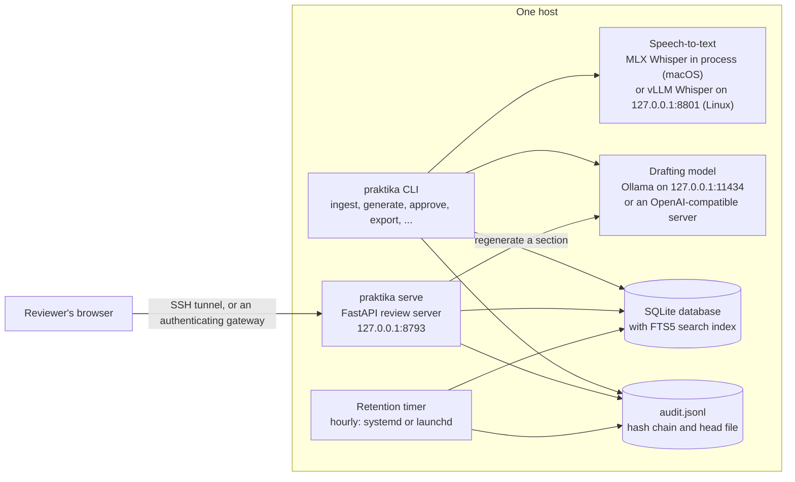
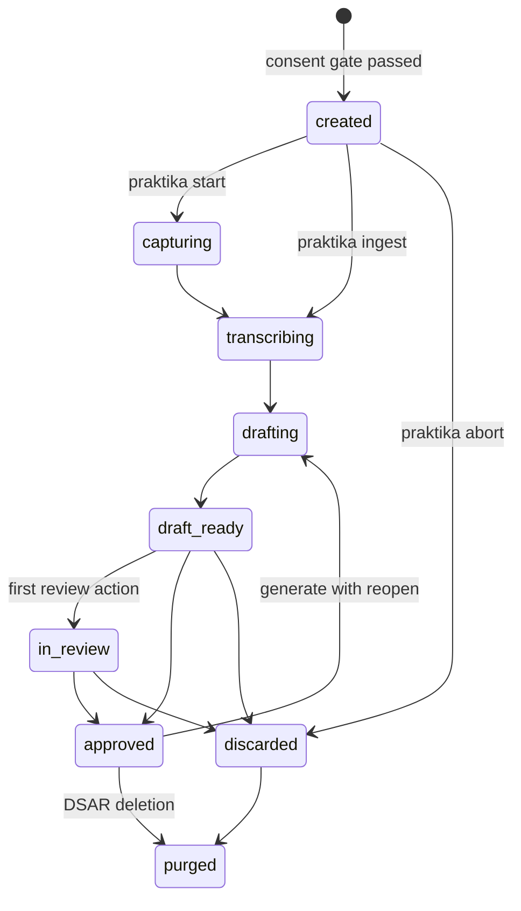

# Architecture

Praktika is one Python 3.12 package, `praktika`, with a command-line interface (`praktika`, built
with Typer) and a review server (FastAPI under uvicorn). It runs on one host. The models run beside
it on the same host: the drafting model in Ollama or an OpenAI-compatible server such as vLLM,
reached over HTTP on loopback; speech-to-text either in process on Apple silicon (MLX) or in a vLLM
container on a Linux GPU server. Nothing is sent anywhere else: every request Praktika makes while
processing meetings is checked against a configured allow-list. The one exception is the setup
command `praktika models pull`, which downloads model weights from Hugging Face with its own
client (see the model register under [Cross-cutting mechanisms](#cross-cutting-mechanisms)).

## Components

| Layer | Modules (under `src/praktika/`) |
|---|---|
| Command line | `cli/` (one module per command group; `cli/steps.py` holds the pipeline steps) |
| Review server | `server.py`, `server_review.py`, `server_export.py`, `server_auth.py`, `server_support.py`, `static/` |
| Consent, scope and policy | `consent.py`, `scope.py`, `policy.py` |
| Ingest | `ingest/vtt.py`, `ingest/docx_transcript.py`, `ingest/audio_file.py`, `ingest/graph_stub.py` (protocol only) |
| Audio and speech | `audio/` (conversion, voice activity detection, live capture), `stt/` (engines and routing), `diarize/` |
| Redaction | `redact/` (patterns, names, tokeniser and encrypted vault), `glossary.py` |
| Drafting and verification | `llm/` (clients, prompts, chunking, pipeline, assembly, verifier) |
| Rendering | `render/` (Markdown and DOCX), `templates/render/` at the repository root |
| Storage | `store/` (SQLite schema, repository, artefacts, run locks, search) |
| Cross-cutting | `config.py`, `audit.py`, `identity.py`, `retention.py`, `retention_files.py`, `models_registry/`, `eval/` |

The prompts (`prompts/v1/`), the glossary (`glossary.yaml`) and the export templates
(`templates/render/`) live at the repository root and are not packaged, so Praktika runs from a
checkout installed in editable mode (`uv sync`, or `pip install -e`); a built wheel on its own
stops with "configured path(s) not found". `PRAKTIKA_PROMPTS_DIR` and `PRAKTIKA_GLOSSARY_PATH` can
point elsewhere, and the export templates are then looked for in `templates/render/` beside the
prompts directory.

## The pipeline, step by step

`praktika ingest` runs every step below for one file; `praktika start` does the same for live
microphone capture. `praktika transcribe` and `praktika generate` re-run the speech and drafting
steps on an existing meeting.

1. **Consent and scope gate** (`consent.py`, `scope.py`, `cli/gate_prompts.py`). The organiser's
   answers (notice given, no objections, method, whether the platform's transcription was
   started, purpose, scope checklist) come from flags or, in a terminal, from prompts. The
   classification is not asked for: it comes from `--class`, default `internal`, and the gate
   checks that it is allowed. `consent.gate` is the only way to obtain a
   `ConsentRecord`; on success the meeting and the record are stored and `consent.recorded` is
   audited. A refusal stores nothing and is audited as `scope.refused`.
2. **Run lock** (`store/locks.py`). The run takes the meeting's lock, recorded in the database
   with the command, process id, host and start time. A second run on the same meeting is refused;
   a lock left by a dead process on the same host is taken over and the takeover audited.
3. **Parse or transcribe.**
   * A Teams `.vtt` transcript (`ingest/vtt.py`) or a Teams recap `.docx`
     (`ingest/docx_transcript.py`) becomes segments `S0001`, `S0002`, ... with the speakers'
     display names.
   * An audio file (`.wav`, `.m4a`, `.mp3`, `.mp4`; `ingest/audio_file.py`) is converted by ffmpeg
     to a 16 kHz mono WAV (mode 0600) under `<data_dir>/audio/<meeting-id>/`, split by silero voice
     activity detection into speech chunks of at most 28 seconds (`audio/vad.py`), and transcribed
     chunk by chunk (`stt/router.py`). Whisper is primed with a vocabulary prompt built from the
     roster and the glossary; output is clipped to the audio's duration and duplicate segments are
     dropped. Known misrenderings are then normalised with the glossary (`glossary.py`). `--vtt`
     attaches a Teams transcript whose speaker names are copied onto the speech segments by time
     overlap. Optional diarisation adds anonymous speaker labels.
   * Speech engines are loaded, run and unloaded one after another, and local weights are verified
     against the model register before they are loaded.
4. **Redact** (`redact/`). Identifiers are replaced by stable tokens such as `«IBAN_1»`; the
   token-to-value map (the vault) is encrypted with Fernet under `PRAKTIKA_VAULT_KEY` (or, on a
   Mac in local mode, a key kept in the login Keychain). The redacted transcript and the encrypted
   vault are stored. The drafting pipeline refuses a transcript that is not redacted.
5. **Draft** (`llm/pipeline.py`). A system prompt carries the rules, the roster, the title, the
   meeting date and the template's guidance. A transcript of up to 16,000 tokens is drafted in one
   pass; a longer one is cut into chunks of about 8,000 tokens on speaker turns, with overlap.
   * **Map**: each chunk yields findings (decisions, actions, open questions, risks, figures), each
     citing segment ids and a verbatim quote.
   * **Reduce**: the findings of all chunks are merged. This call sees findings only, never the
     transcript.
   * **Narrative**: a summary and topics are written from the merged findings.
   * **Retraction check**: for each decision the model is asked whether it was withdrawn within
     three segments of its citations; if so a `contradiction` flag is raised.
   * **Assemble**: citations are resolved against the transcript (never trusted from the model),
     owners checked against the roster and spoken due phrases turned into dates by fixed rules.

   Every model call is constrained to a JSON schema (Ollama's `format`, or
   `response_format: json_schema` with `strict` on an OpenAI-compatible server) and audited as
   `llm.call` with the model, prompt hash, sizes and timings, never the content. Above
   `PRAKTIKA_LLM_LONG_TRANSCRIPT_TOKENS` the configured fallback model is used and the draft is
   marked degraded.
6. **Verify** (`llm/verify.py`, `llm/verify_flags.py`, `llm/quotes.py`). A deterministic verifier
   runs on every draft before anyone sees it:
   * citations: the segment exists, the quote is a near-verbatim part of it (after Arabic
     normalisation, with a length guard and a guard on negations and figures), and the segment is
     not an instruction aimed at the model;
   * a decision or action left with no valid citation is moved out of the body into a priority-1
     `uncited_item_removed` flag that keeps its full text, so a reviewer can restore it;
   * advisory flags for numbers not found in the transcript, names not on the roster or in the
     glossary, unmapped speaker labels, low-confidence audio, possible inside information,
     raw identifiers left in the body (priority 1), and a summary that states a decision the body
     does not contain.

   The verifier covers the summary, topics, decisions, actions, open questions, risks and
   follow-ups. It does not cover the management-committee template's `figures_mentioned`
   ("Figures mentioned"), which is copied from the merged findings (`llm/pipeline.py`): its
   segment ids are not resolved and its numbers are not checked. The review page does not show
   that list; the Markdown and DOCX exports do.
7. **Store**. The minutes version is stored with a provenance record (model and digest, prompt
   version and hash, glossary hash, template, git commit, transcript hash, speech engines, model
   hashes) and the meeting moves to `draft_ready`. The command prints the review URL.
8. **Review** (`server_review.py`, `static/`). The page lists flags first, then the minutes beside
   the transcript. Clicking a citation highlights its segment and, for a recording, plays that
   slice of audio. The reviewer maps speaker labels to names; accepts, modifies, rejects or
   restores each item with a reason code; clears flags; can regenerate one section with an
   instruction; and approves or discards. Approval is refused while a priority-1 flag is open, and
   every write is refused with HTTP 409 while a run holds the meeting's lock.
9. **Approve and export** (`policy.py`, `render/`). Approval indexes the minutes for search
   (except one-to-ones and restricted minutes) and starts the retention clock. `praktika export`
   writes Markdown or DOCX (mode 0600) to `<data_dir>/exports/` with the classification in header
   and footer and a provenance footer; identifiers are restored from the vault only with
   `--detokenise`, and only for approved, non-restricted minutes. Praktika never sends the result
   anywhere.

## Meeting states

Every transition made by a run, a reviewer or `praktika abort` is a compare-and-set in the store;
only a live capture that stops because of an abort, and a DSAR deletion, set the state
unconditionally. Transitions are not audited as events of their own: the steps that cause them are
(`ingest.*`, `redact.applied`, `minutes.drafted`, `review.*`, `capture.aborted`, `dsar.delete`). A
failed first ingest returns the meeting to `created` with its consent record; `praktika abort` or a
discard on the review page always wins over a running step, which then removes only what it stored
itself. A successful `praktika transcribe` leaves the meeting at `transcribing` (a new transcript
awaiting `praktika generate`), and approval refuses a draft built from an older transcript.

## Cross-cutting mechanisms

**Configuration** (`config.py`). Every setting is a `PRAKTIKA_` environment variable or a line in
one env file: the file `PRAKTIKA_ENV_FILE` names, or else `.env` inside the per-account default
data directory. A `.env` in the working directory is never read. A named file that is missing or
unreadable stops every command. An unknown key in the env file is a start-up error; a misspelt
variable in the process environment is silently ignored, so `praktika config show` is the check.
Secrets
(`PRAKTIKA_VAULT_KEY`, `PRAKTIKA_LLM_TOKEN`, `HF_TOKEN`) are read from the process environment
only.

**Egress allow-list** (`config.py`). `PRAKTIKA_ALLOWED_HOSTS` lists host patterns. Every URL
setting is validated against it at start-up, and every HTTP client is built with a transport that
checks the host of each request. In service mode the same list is also the trusted `Host` list for
inbound requests. The one outbound path outside it is `praktika models pull`
(`models_registry/manage.py`), which lifts the forced `HF_HUB_OFFLINE` for its own download and
reaches Hugging Face through the `huggingface_hub` client; it is a setup command for a connected
machine and is never called while a meeting is processed.

**Audit log** (`audit.py`). Every consent, refusal, capture event, ingest, speech run, model call,
redaction, draft, review action, approval, discard, audio read, export, retention deletion, hold,
DSAR action and audited denial is one JSON line with `ts`, `actor`, `actor_source`, `event`,
`meeting_id`, `classification`, `object`, `detail`, `model`, `prompt_sha`, `prev_hash` and `hash`.
Each line carries the previous line's hash. The log is appended with `fsync` to `audit.jsonl`, its
last hash is kept in `audit.jsonl.head`, and the same events go to an audit table in the database;
`praktika audit verify` cross-checks all three, so a truncated or deleted log is detected. Appends
from several processes are serialised with an `flock` and a database transaction. With
`PRAKTIKA_AUDIT_SINK=stdout` a copy of each line also goes to `audit-forward.jsonl` (rotated at
64 MiB, five backups) for a log shipper.

**Retention** (`retention.py`, `retention_files.py`). Timers per classification delete:

* audio at the first run after the minutes are approved or discarded, and in any case at the first
  run once `retention_audio_hours` have passed since conversion; with 0 hours, at the first run
  after transcription;
* the transcript and its vault `retention_transcript_days` after approval, and in any case at a
  hard maximum after the first transcript row was stored, approved or not: 60 days, or 30 for
  Restricted (`TRANSCRIPT_MAX_DAYS`, fixed in code and not a setting);
* unapproved draft versions `retention_draft_days` after approval or, for a meeting never
  approved, after its latest draft.

Approved minutes and exports have no timer. Audio is overwritten with zeros, synced and unlinked
before its row is updated; database artefacts are deleted or blanked (a tombstone keeps the hash
and timestamps). A legal hold blocks every timer for a meeting. Timers run at the start of every
command that opens the meeting store (`ingest`, `start`, `transcribe`, `generate`, `abort`,
`approve`, `export`, `search`, `actions`, `hold`, `dsar`; `cli/context.open_runtime`), once when
`serve` starts (not while it runs), with `praktika retention run`, and hourly from the scheduler
`praktika retention install` sets up. Without the scheduler, nothing is deleted until one of those
commands runs. Every deletion is audited as `retention.deleted`.

**Identity and authorisation** (`identity.py`, `server_auth.py`). In local mode the identity is
the operating-system account, and the review server binds loopback only and requires a per-data-
directory session token (`X-Praktika-Token`) on every API call. In service mode the server refuses
to start unless the identity provider is OIDC: a bearer JWT is validated against the issuer's JWKS
(RS256, issuer, audience, expiry), and roles come from four group names or app roles
(`Praktika-Users`, `Praktika-Secretaries`, `Praktika-DPO`, `Praktika-Admins`). The organiser may
act on their meetings, a secretary on any non-private meeting, and the DPO and administrator roles
may read but never act. A request guard checks the `Host` header (against DNS rebinding), requires
`X-Praktika-Review: 1` on every POST and checks `Origin`/`Referer` (against cross-site requests).

**Policy** (`policy.py`). One module answers "is this classification allowed here", "may these
minutes be exported" and "may these identifiers be restored". It is default-deny: an unknown action
is refused.

**Model register** (`models_registry/`). `models.yaml` in the models directory records each
model's role, repository, revision, licence and per-file SHA-256. `praktika models pull` mirrors a
role from Hugging Face on a connected machine; `praktika models register` records weights brought
in by other means; `praktika models verify` re-hashes everything.

## Data on disk

| Path | Contents | Mode |
|---|---|---|
| `<data_dir>/` | Everything below. Default `~/Library/Application Support/Praktika` on macOS, `$XDG_DATA_HOME/praktika` or `~/.local/share/praktika` on Linux | 0700 (enforced) |
| `<data_dir>/praktika.db` | SQLite (WAL): meetings, consent records, retained-media rows, tokenised transcripts, encrypted vaults, minutes versions, review items, holds, run locks, the audit mirror and the FTS5 search index | 0600 |
| `<data_dir>/audio/<meeting-id>/` | Converted WAV files under their retention timer | 0700 directory, 0600 files |
| `<data_dir>/exports/` | Exported minutes and DSAR bundles | 0700 directory, 0600 files |
| `<data_dir>/audit.jsonl`, `.head`, `.lock` | The audit chain, its last hash and its lock file | 0600 |
| `<data_dir>/audit-forward.jsonl` | Copy of the audit stream for a log shipper (`PRAKTIKA_AUDIT_SINK=stdout` only) | 0600 |
| `<data_dir>/review.token` | The local review session token | 0600 |
| `<data_dir>/audio/<meeting-id>/capture.pid` | The process id of a live capture, while `praktika start` records | as created |
| `<data_dir>/retention.log` | Output of the macOS launchd retention agent (on Linux it goes to the journal) | as created |
| `<data_dir>/endpoint-agent.ok` | Marker file that a log-shipping agent is expected to write; Praktika only reads it (`doctor`) | written by the agent |
| `.env` in the default data directory | The default env file, read when `PRAKTIKA_ENV_FILE` is not set; `PRAKTIKA_DATA_DIR` does not move it | written by you |
| `bin/praktika-capture` in the default data directory | The default location of the signed system-audio capture helper for `praktika start --source sck` (not part of this repository) | installed by you |
| `<models_dir>/models.yaml`, `<models_dir>/<role>/` | Model register and weights. Default `~/praktika-models` | as created |

## Extending it

* **A new speech, LLM or diarisation backend** implements the `Protocol` in `stt/base.py`,
  `llm/base.py` or `diarize/base.py`, adds its name to the matching `Literal` in `Settings`, and is
  constructed in `stt/engines.build_transcribers` or `cli/context.llm_client`. Any HTTP client must
  come from `Settings.http_client()` so that the allow-list applies.
* **A new minutes template** needs a `Minutes` subclass in `models/minutes.py`, a `TemplateSpec` in
  `llm/prompts.TEMPLATES`, guidance in `prompts/v1/templates/<name>.md`, a renderer in
  `templates/render/<name>.md.j2` and a golden meeting under `tests/fixtures/golden/`.
* **A prompt change** changes the prompt-set hash: update `PINNED_SHA256` in `llm/prompts.py`
  (computed by `llm.prompts.version_sha256`), run `praktika eval`, and record why in the changelog.
